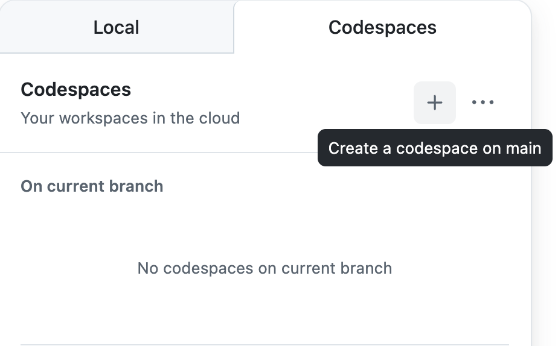

## Hit-and-Blow
プレイヤー同士でお互いの 3 桁の数字を当てるゲームです．

予めお互いに 3 桁の数字を決めてそれぞれ相手の数字が何なのか順番に推理して先に相手の数字を当てた方が勝利となります．

ゲーム画面はこちらから見てください．

[ゲーム画面](https://socsel-siseminar1-2024.github.io/Hit-and-Blow/)
### 📃 仕様書

[ここ](https://www.figma.com/file/aedhG4wlTaOTKxccKI9a6S/SIseminar-2024-Hit%26Blow?type=design&node-id=0-1&mode=design&t=DCxI8fYMzDXvkzbX-0)からみてください

***

## 演習について
webアプリケーションを実装するための第一歩としてwebのDOMを操作する演習です。アプリ開発総合演習では、JavaScriptを使用している人もいるかと思います。やっていること自体は変わらないので、ぜひ挑戦してみて下さい。

### 課題の例
1 つでも多くの課題にチャレンジしてみてください！！例以外の機能の実装も大歓迎です！

- リファクタリング
  - 変数名、メソッド名、クラス名の統一
  - 実行速度の向上
  - 可読性の向上
- ページの見た目の変更(html,css の編集)
- 仕様書の意図に沿わない機能の修正(最初の入力に対する例外処理など)
- CPU を賢くする（現状は完全ランダム）
- ヒント機能実装（ちょいムズ，がんばれ！）1 つでも多くの課題にチャレンジしてみてください！！例以外の機能の実装も大歓迎です！

※ わからないこと・気になることがあればTAに声をかけてください


## 実行方法（コードスペースの起動方法）
この文章が見えているページでキーボードの"."を押すか以下の手順で起動できます．
1. 右上の"<> Code"ボタンをクリック
2. 右側の"Codespaces"を選択
3. codespacesの"+"（Create a codespace on main）をクリック





## 実行方法（ローカル環境で実装）
*Pythonのローカル環境が手元にある人のみ

1.下のコマンドで，任意のディレクトリにダウンロード

```
git clone https://github.com/SocSEL-INFOseminar1-2025/Hit-and-Blow.git
```

2. クローンしてきたファイルのうち，html ファイルを chrome のブラウザで表示する(ドラック＆ドロップでできます！)
3. 手元で編集した後に，更新を行う
4. 下のコマンドでサーバーを立ち上げる

```
python3 -m http.server
```

もしくは

```
python -m http.server
```

5. http://localhost:8000/
   にアクセスすると確認できます！

### うまくいかない人

1. 以下のコマンドで 8000 番のポートが解放されているか確認

```
lsof -i :8000
```

2. ターミナルに表示された PID(例えば 10128)をつけて以下のコマンドを入力

```
kill -9 10128
```

## コミット・プッシュ・プルリクエストについて
コミットおよびプッシュ（コード変更）は **必ずブランチを作成してから** 行ってください
（codespace上でコミットを行う場合は，コミット時に表示される注意書きの， 新しいブランチにコミットする を押してください．ブランチを作成してから作業を行なっても問題ありません．ブランチ名は自由ですが"作業内容/氏名"を推奨します）

プルリクエストは，テンプレートを用意しているので，[Pull requests](https://github.com/SocSEL-INFOseminar1-2025/rsp-game-go/pulls "rsp-game-go_pulls")から作成することを推奨します

マージ操作は行わないでください
